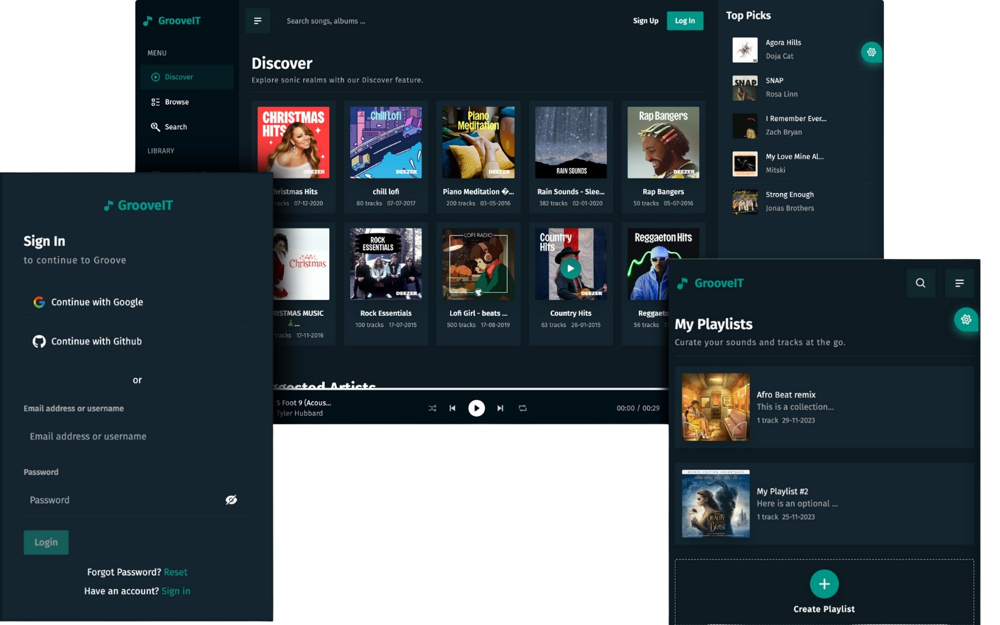

# GrooveIt Music App

Welcome to GrooveIt, a cutting-edge music application built with ReactJs and Firebase that seamlessly integrates with the Deezer music API to bring you an immersive music experience.
GrooveIt not only provides a vast library of songs but also enhances your music journey with a user-friendly interface and a range of features to keep you in control.

## Table of Contents

- [Description](#description)
- [Features](#features)
- [Screenshots](#screenshots)
- [Live Demo](#live-demo)
- [Tech Stack](#tech-stack)
- [Installation](#installation)
  - [Firebase Setup](#firebase-setup)
- [Usage](#usage)
- [Additional Information](#additional-information)

## Description

GrooveIt is a music app designed to enhance your listening experience. With a clean and intuitive user interface, users can easily sign in, discover, and enjoy their favorite tunes. The app leverages the power of ReactJs for a dynamic frontend and Firebase for a scalable and reliable backend. <br />
GrooveIt provides a seamless music listening experience with features such as user authentication, song playback controls, search functionality, playlist creation, and a customizable theme switcher.

## Features

1. **User Authentication:**

   - Sign in, sign up, and password reset functionalities.

2. **Playback Controls:**

   - Play, pause, skip, and loop songs with ease.

3. **Volume Control:**

   - Adjust volume, mute/unmute while enjoying your music.

4. **Search Functionality:**

   - Search for songs by song name, artist name, or album name.

5. **Like Songs:**

   - Like your favorite songs to build a personalized collection.

6. **Playlist Creation:**

   - Create and manage playlists tailored to your taste.

7. **Song Details:**

   - Explore song details, including cover image, singer, and album information.

8. **Persistent Music Player:**

   - A music player component accessible across all pages, allowing uninterrupted music playback.

9. **Cross-Page Playback:**

   - Keep the music playing while navigating through different sections of the app.

10. **Theme Switcher:**
    - Fully customizable theme switcher to personalize your visual experience.

## Screenshots



## Live Demo

Check out the live demo of GrooveIt [here](https://groov.netlify.app/).

## Tech Stack

- **Frontend:**

  - ReactJs
  - Vite
  - React Query
  - TailwindCSS

- **Backend:**

  - Firebase (Authentication, Firestore, Storage)

- **API Integration:**
  - Deezer Music API

## Installation

To run GrooveIt locally, follow these steps:

1. Clone the repository:

   ```bash
   git clone https://github.com/adaorachi/groove-it.git
   cd groove-it
   ```

2. Install dependencies:

   ```bash
   npm install
   ```

3. Start the server:

   ```bash
   npm run dev
   ```

4. Create a new .env file and add the necessary firebase configurations. Firebase setup will be covered in the next step. We also created and hosted a CORS server on [render.com](https://render.com/) in order to pull data from the deezer music API. Here is the github repo for the [CORS server](https://github.com/adaorachi/cors/)

   ```
   VITE_PUBLIC_FIREBASE_API_KEY={apiKey}
   VITE_PUBLIC_FIREBASE_AUTH_DOMAIN={authDomain}
   VITE_PUBLIC_FIREBASE_PROJECT_ID={projectId}
   VITE_PUBLIC_FIREBASE_STORAGE_BUCKET={storageBucket}

   VITE_PUBLIC_CORS_URL=https://cors-redirect-service.onrender.com
   VITE_PUBLIC_DEEZER_API_URL=https://api.deezer.com
   VITE_PUBLIC_AUTH_RESET_PASS_ACTION_URL=http://localhost:5173/login
   ```

## Firebase Setup

1. Create a Firebase project [here](https://firebase.google.com/).
2. Obtain your Firebase configuration details.
3. Enable Authentication, Firestore, and Storage services.
4. Deploy the firestore security rules/indexes and storage security rules if you are on a paid plan OR copy and paste them if you are not on a paid plan.
5. Locate the above rules/indexes in the following files
   - firestore security rules - firestore.rules
   - firestore indexes - firestore.indexes
   - storage security rules - storage.rules
6. Customize password reset custom action URL from your firebase authentication dashboard. Go to Authentication, click on Templates menu, select Password reset tab and click on "Customize action URL" link. Add {domainURL}/verify-reset-password, eg - http://localhost:5173/verify-reset-password

## Additional Information

- Question: Should you have any questions, comments, or suggestions, kindly email us at [annychuks07@gmail.com](mailto:annychuks07@gmail.com)

- Issues: Found a bug or have a feature request? Open an issue [here](https://github.com/adaorachi/groove-it/issues).

- License: This project is licensed under the [MIT License](/LICENSE.txt).

Feel the rhythm, dive into the melodies, and let GrooveIt elevate your music experience! 🎶
